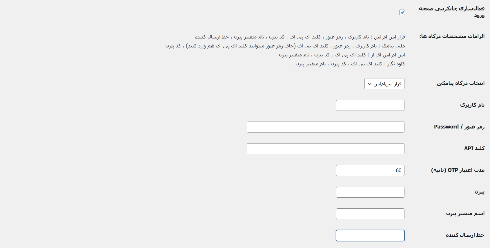
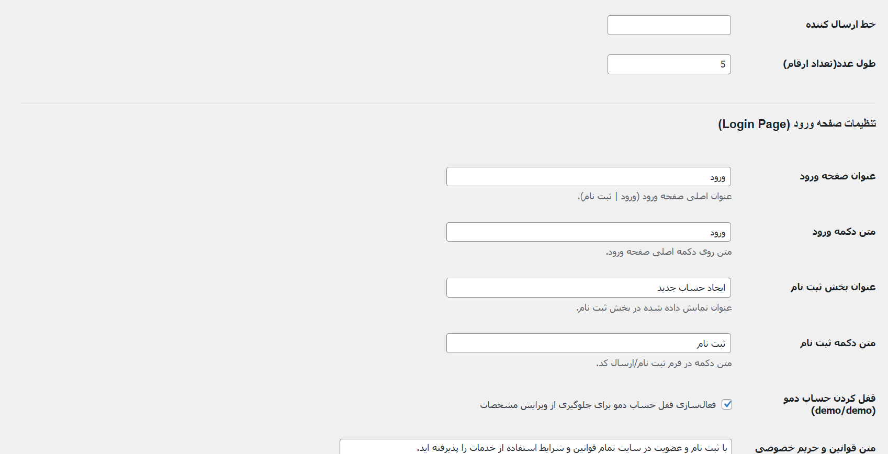
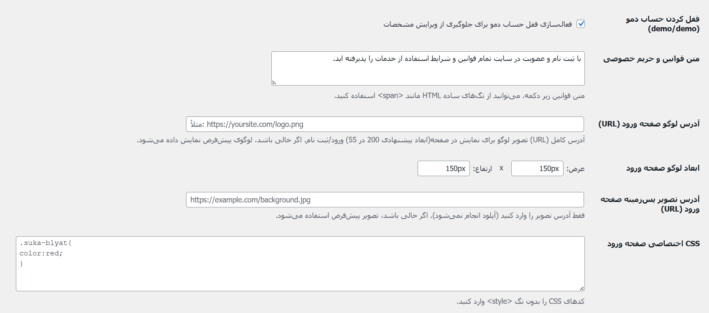

# OTP Verifier

A lightweight, optimized WordPress plugin for OTP-based login and signup.

## Highlights
- Very light and performance-focused for fast login/signup flows
- OTP login and registration with a clean UX
- Supports 4 popular SMS gateways: FarazSMS, MelliPayamak, SMS.ir, and Kavehnegar
- One‑click migration from Digits (migrate numbers and accounts)
- Built for WooCommerce account flow overrides

## Features
- OTP login and signup (phone-based)
- Customizable login page (logo, titles, button text, background)
- SweetAlert2 feedback messages
- User‑friendly OTP input flow
- AJAX-powered verification
- Replaces WooCommerce **/my-account** login/signup with the OTP UI

## Technical Features
- Phone-based rate limiting (3 OTP requests per 5 minutes)
- IP-based rate limiting (10 requests per 5 minutes) — applied to OTP **and** password login endpoints
- Brute‑force protection with max OTP verify attempts (5 tries)
- OTP length capped between 4 and 6 digits
- Automatic cleanup via WP‑Cron — two dedicated jobs: OTP table cleanup (every 10 min) and rate-limit transient cleanup (hourly)
- Custom database table for OTP codes
- Database-version migration on update (auto‑alters schema without requiring reactivation)
- OOP, class‑based architecture (Repository pattern for storage, Strategy + Factory for SMS gateways)

## Security
- **OTP codes are never stored in plaintext** — they are hashed with HMAC-SHA256 (keyed with `wp_salt`) before being written to the database
- **Constant-time verification** with `hash_equals()` to eliminate timing side-channels
- **Fail-closed rate limiting** — if the counter cannot be persisted, the request is denied rather than allowed, so the limit cannot be bypassed
- **Gated logging** — diagnostic logs are written only when `WP_DEBUG` is enabled, never in production
- **No sensitive data in logs** — OTP codes are never logged, and phone numbers are masked (e.g. `0912****89`)
- Nonce verification on all AJAX endpoints and strict input sanitization
- OTP-only signups use a placeholder email built from the site's own domain (no reserved `example.com`)

## Supported SMS Gateways
- FarazSMS
- MelliPayamak
- SMS.ir
- Kavehnegar

## One‑Click Migration
Migrate users and phone numbers from the Digits plugin with a single click.

## Requirements
- WordPress (recommended: latest stable)
- WooCommerce (for My Account override)
- PHP (recommended: 7.4+)

## Installation
1. Download or clone this repository.
2. Upload the plugin folder to `wp-content/plugins/`.
3. Activate **OTP Verifier** from the WordPress admin.

## Configuration
1. Go to **OTP Verifier** settings in the WordPress admin.
2. Enter your SMS gateway credentials.
3. Customize login page text, logo, and background if desired.
4. Save settings.

## Usage
- Visit the WooCommerce My Account page to see the OTP login/signup UI.
- Users can register or log in using their phone number.

## Screenshots
Admin Panel

Login UI

## Roadmap
- Additional gateways
- Enhanced analytics and logging

## Changelog

### 1.1.0
- **Security:** OTP codes are now hashed (HMAC-SHA256) instead of stored in plaintext
- **Security:** verification uses constant-time `hash_equals()` to prevent timing attacks
- **Security:** rate limiter is now fail-closed (denies on storage failure instead of allowing)
- **Security:** added IP rate limiting to the password-login endpoint
- **Privacy:** logging is gated behind `WP_DEBUG`; OTP codes removed from logs and phone numbers masked
- **Fix:** OTP-only signups use the site domain for placeholder emails instead of `example.com`
- **Fix:** split the single overloaded cron hook into two dedicated jobs (OTP cleanup every 10 min, transient cleanup hourly)
- **Fix:** widened the `code` column to `varchar(255)` and added automatic DB-version migration so the hash is never truncated on file-only updates

### 1.0.0
- Initial release: OTP login/signup, four SMS gateways, Digits migration, WooCommerce My Account override

## License
GPL-2.0-or-later
