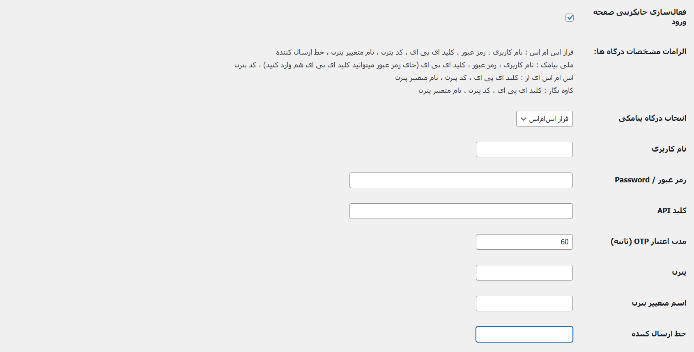
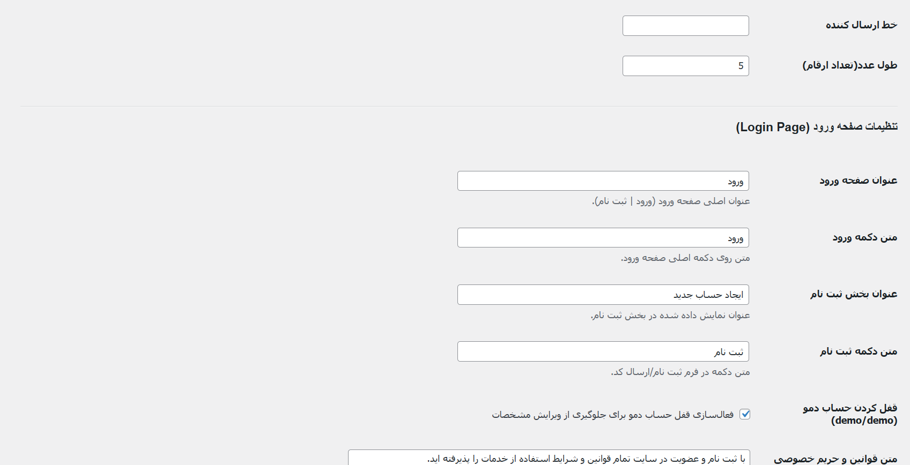
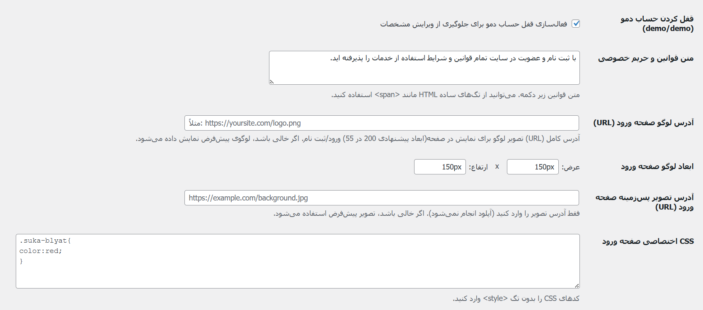

# OTP Verifier

**Passwordless phone login, signup and WooCommerce checkout phone verification for WordPress — with one-time codes (OTP) sent by SMS.**


OTP Verifier replaces the WooCommerce **My Account** login page with a clean, branded, phone-first login/signup screen, lets customers **prove their phone number at checkout**, and talks to the four most popular Iranian SMS providers. It is small, dependency-free (jQuery + SweetAlert2 only), and built with security in mind: hashed codes, constant-time comparison, fail-closed rate limiting and server-side enforcement.

> The interface is Persian (RTL) and the plugin targets **Iranian mobile numbers** (`09xxxxxxxxx`). Every visitor-facing title, button label and legal text on the login page is editable from the settings.

## Table of contents

- [Highlights](#highlights)
- [Features](#features)
  - [OTP login & signup](#1-otp-login--signup)
  - [Login page customization](#2-login-page-customization)
  - [WooCommerce checkout phone verification](#3-woocommerce-checkout-phone-verification)
  - [Smart code entry & SMS autofill](#4-smart-code-entry--sms-autofill)
  - [SMS gateways & test tool](#5-sms-gateways--test-tool)
  - [User migration](#6-user-migration)
  - [Admin conveniences](#7-admin-conveniences)
- [Security](#security)
- [Limits at a glance](#limits-at-a-glance)
- [Requirements](#requirements)
- [Installation](#installation)
- [Configuration guide](#configuration-guide)
- [Settings reference](#settings-reference)
- [Troubleshooting & FAQ](#troubleshooting--faq)
- [Technical reference](#technical-reference)
- [Screenshots](#screenshots)
- [Roadmap](#roadmap)
- [Changelog](#changelog)
- [License](#license)

## Highlights

| | |
|---|---|
| **Phone-first login & signup** | Enter a number, enter the code, you are in. New numbers get an account automatically; existing numbers are logged in. |
| **Two login modes** | Classic (username/password, signup form *and* phone login) or *phone number only* (a single field, nothing else). |
| **Checkout phone verification** | Make customers verify their phone with an OTP before an order can be placed — inline next to the phone field, or as a full-lock step before the form. |
| **Same experience everywhere** | The login page and the checkout share one flow: button loading states, toast notifications, separate code boxes, resend countdown, attempt limit. |
| **SMS autofill** | Codes are read from the incoming SMS (WebOTP on Chrome/Android) or suggested by the keyboard (iOS/Android) and verified automatically. |
| **4 SMS gateways** | FarazSMS, MeliPayamak, SMS.ir and Kavenegar, with a built-in test-SMS tool. |
| **Migration tools** | One-click migration from **Digits**, plus a universal migrator for any other OTP/login plugin (preview, batches, undo). |
| **Hardened by default** | Codes stored as HMAC-SHA256 hashes, `hash_equals()`, per-phone and per-IP rate limits, 5-attempt lockout, nonces everywhere, no secrets in logs. |
| **Fully brandable** | Logo, size, background image, colour overlay, titles, button texts, privacy text, custom CSS, checkout accent colour. |

## Features

### 1. OTP login & signup

The plugin takes over the WooCommerce **My Account** page for **logged-out visitors** and shows its own standalone login page (its own HTML document, with the bundled *YekanBakh* font, RTL). Logged-in customers still see the normal WooCommerce account area.

**Two modes, chosen in the settings**

| Mode | What the visitor sees |
|---|---|
| **Classic** (default) | Username/email + password login, a *sign up* form (username, password, phone) and a *log in with phone number* option. Signup and phone login always confirm the number with an OTP (phone login requires an existing account). |
| **Phone number only** | One phone field and one button. Enter the number, enter the code — an existing account is logged in, otherwise a new one is created (its username is the phone number). The username/password form, the signup form and every link to them are not rendered at all. |

**The OTP flow**

1. The visitor enters a phone number (Persian digits and the `+98` / `98` prefixes are understood and converted to `09xxxxxxxxx`).
2. The send button switches to a loading state ("در حال ارسال...") and a code is sent by SMS.
3. A toast confirms it — *"کد تایید برای شماره 0912\*\*\*4567 ارسال شد"* — and the form is replaced by the code step: masked number, a back arrow, the code boxes, a resend link with a countdown, and the verify button.
4. Wrong codes show a toast plus an inline message with the remaining attempts; after **5** wrong codes the visitor is sent back to request a new code.
5. On success the visitor is logged in and redirected to the WooCommerce My Account page (or the home page if WooCommerce is unavailable).

**Account handling**

- **New accounts** are created with the `customer` role and the number stored in the `phone_number` user meta. A random password is generated unless the signup form supplied one.
- **Placeholder email** for OTP-only signups is built from your own domain (`09123456789@yoursite.com`), never the reserved `example.com`. If the visitor typed an email as the username, that email is used.
- **Duplicate protection** — a username already tied to a different number, or a number already tied to a different username, is rejected with a clear message.
- **Existing Digits users** are recognised through `digits_phone_no`; on their first OTP login their number is copied to `phone_number` automatically.
- **Password login** is still available in classic mode (username or email + password) and is protected by the IP rate limit.
- **Deep link prefill** — open the login page with `?phone=09123456789` to have the number filled in.
- A fresh OTP **invalidates** any previous code for that number.

### 2. Login page customization

Everything below is editable from the **Login Page** section of the OTP Verifier settings — no template editing needed.

- **Texts:** page title, main button text, signup section title, signup button text, and the terms/privacy text under the button (simple HTML such as `<span>` is allowed).
- **Logo:** URL and width × height (the bundled default logo is used when empty).
- **Background:** image URL (the bundled background is used when empty) and an optional **colour overlay** (colour + 0–100 % opacity) for readable content on busy photos.
- **Custom CSS:** a free-form field appended to the login page.
- Responsive layout with a 420 px card, rounded fields, password show/hide toggles and SweetAlert2 toast notifications.
- An **on/off switch** for the whole login-page replacement.

### 3. WooCommerce checkout phone verification

Require customers to verify their phone number with an OTP before they can place an order. Enable it in the **Checkout** section of the OTP Verifier settings and pick a mode:

| | **Inline** (default) | **Gate** (full lock) |
|---|---|---|
| Where | Right below WooCommerce's own *billing phone* field — no extra field is added. | A step **before** the checkout form; the form is completely hidden (inline CSS, so it never flashes) until the phone is verified. |
| Flow | *Send code* button → code boxes → verify. The **Place order** button stays disabled until the number is verified. | Phone step → code step (the phone step is replaced, like the login page) → the checkout form appears with the verified number filled in and locked. |
| Number source | The billing phone the customer typed. | An input in the gate, pre-filled from the customer's saved billing phone or account phone. |

**What both modes share**

- The *same* experience as the login page: loading labels, toast notifications, separate code boxes with paste/autofill/WebOTP support, resend countdown, masked number, 5-attempt limit and inline error messages.
- **Server-side enforcement** on `woocommerce_checkout_process`: an order is only accepted when the number in the form equals the number verified in the WooCommerce session. The UI is a convenience — the server is the gate. Changing the phone after verifying invalidates the verification.
- **Logged-in customers are exempt by default** (their account is already authenticated). Turn on *Require verification for logged-in users* to apply the same rule to everyone.
- **Accent colour picker** for the checkout buttons and links. The button text automatically switches to dark on very light colours, and the styles are scoped and pinned so themes cannot override your colour.
- **Robust against themes:** if a theme or plugin removed the `billing_phone` field, the plugin puts it back (and marks it required) whenever verification is on.
- Uses the same OTP engine, gateway, rate limits and attempt limit as the login page.
- Forgiving number input: Persian/Arabic digits, `+98` / `0098` / `98` prefixes and a missing leading zero are all converted to `09xxxxxxxxx`.

> **Classic checkout only.** The `[woocommerce_checkout]` shortcode checkout is supported. The block-based *Cart & Checkout* is not — the feature stays inactive there (a warning is written to the debug log).

### 4. Smart code entry & SMS autofill

The code is entered in individual boxes (one per digit, LTR), and *every* way of getting a code into them works:

- **Typing** — auto-advance, backspace-to-previous, arrow keys, a typed digit overwrites the box.
- **Paste** — a full code pasted into any box is distributed across all boxes.
- **Browser / keyboard autofill** — the first box is `autocomplete="one-time-code"`, so the iOS/Android keyboard SMS suggestion and password-manager autofill work; boxes accept a whole code at once.
- **WebOTP autofill** (Chrome on Android) — the code is read straight from the incoming SMS with no tapping. The client starts listening *before* the send request so an SMS that beats the server response is not missed.
- **Auto-verify** — as soon as the last digit lands, the code is submitted. Persian/Arabic-Indic digits are converted to ASCII and other characters dropped.
- The code length follows the setting, clamped to 4–6 digits on both server and client.

> WebOTP requires the **last line of your SMS pattern** to be `@yourdomain.com #code`, where the host is *exactly* the host the site is opened on. This is configured in your SMS provider's panel, not in the plugin. See [Troubleshooting](#troubleshooting--faq).

### 5. SMS gateways & test tool

| Gateway | Admin label | Required settings |
|---|---|---|
| **FarazSMS** | فراز اس‌ام‌اس | username, password, API key, pattern code, pattern variable name, sender line |
| **MeliPayamak** | ملی پیامک | username, password (or an API key in its place), pattern (body ID) |
| **SMS.ir** | SMS.ir | API key, pattern code, pattern variable name |
| **Kavenegar** | کاوه‌نگار | API key, pattern code, pattern variable name |

All gateways send the code through the provider's **pattern/template** (verify-lookup) API with a 15-second timeout. A **Test SMS** tool on the settings page sends the sample code `1234` to any number, so you can validate credentials and the pattern before going live.

### 6. User migration

**One-click Digits migration** (settings page): finds every user with a `digits_phone_no` and stores a standard `09xxxxxxxxx` number in `phone_number`. Only needed once — Digits users are also migrated automatically on their first OTP login.

**Universal migrator** (**OTP Verifier → Migrate users**) for *any* other OTP/login plugin:

1. **Find the meta keys** — an automatic scan lists the user-meta keys whose values look like Iranian mobile numbers, or enter a number you already know and the tool tells you which keys hold it. Click *add to list*.
2. **Preview (no changes)** — enter up to 10 keys (comma-separated, order = priority). You get counts of users *ready / already migrated / already having another number / owned by someone else / duplicated / invalid*, the number formats found (`09…`, `9…`, `+98…`, `0098…`, Persian digits, spaces/dashes), per-key statistics, samples of each case, and how many users have *different* numbers in different keys.
3. **Confirm & run** — tick the backup confirmation and start. The migration runs in small AJAX batches (200 users at a time) with a progress bar.
4. **Undo** — every record the tool writes is marked, so the whole migration for those keys can be rolled back.

**Safety guarantees:** only `phone_number` is added; the original meta is never modified; an existing `phone_number` is never overwritten; a number already owned by another user (in any format) is skipped; a number shared by several source users goes to one user only, so the same person can never end up with two accounts and phone login is never ambiguous. The first *valid* number in key-priority order wins, so garbage in the first key falls through to the next. Access requires `manage_options` and a nonce.

### 7. Admin conveniences

- A top-level **OTP Verifier** menu with everything on one settings page, plus the *Migrate users* sub-page.
- A **phone number column** in **Users → All Users**, sortable, that also shows Digits-only numbers (tagged *Digits*).
- Automatic **database upgrades** on update — no reactivation needed.
- **Clean uninstall** — settings, the OTP table, scheduled jobs and rate-limit transients are removed (user phone numbers are kept so accounts keep working if you reinstall).

## Security

- **Codes are never stored in plaintext** — HMAC-SHA256 keyed with your WordPress salt; codes are generated with `wp_rand()`.
- **Constant-time verification** with `hash_equals()` to remove timing side-channels.
- **Brute-force lockout** — at most **5** verification attempts per code; after that the code is destroyed and a new one must be requested.
- **Rate limiting** per phone number (3 codes / 5 min) and per IP (10 requests / 5 min) — the IP limit also protects the **password login** endpoint. The limiter is **fail-closed**: if the counter cannot be saved, the request is denied.
- **Short-lived codes** (configurable expiry), expired codes are removed by scheduled cleanup, and a new code invalidates the previous one.
- **Nonce verification** on every AJAX endpoint and strict input sanitisation/validation; admin tools also check `manage_options`.
- **Server-side checkout enforcement** — the order is rejected unless the submitted phone equals the verified phone stored in the WooCommerce session.
- **Privacy-aware logging** — logs are written **only when `WP_DEBUG` is on**; OTP codes are never logged and phone numbers are masked (`0912****89`), and credentials are masked when a gateway request URL is logged.
- **Safe placeholder emails** built from the site's own domain.

## Limits at a glance

| Item | Value |
|---|---|
| Code length | 4–6 digits (setting; default 4 on a fresh install) |
| Code validity | Configurable in seconds (default 60 on a fresh install; 120 if unset) |
| Resend countdown | Same as the code validity |
| Verification attempts per code | 5 |
| Codes per phone number | 3 per 5 minutes |
| OTP-send and password-login requests per IP | 10 per 5 minutes |
| SMS gateway timeout | 15 seconds |
| Expired-code cleanup | every 10 minutes (WP-Cron) |
| Rate-limit transient cleanup | hourly (WP-Cron) |
| Migration batch size | 200 users per request, up to 10 meta keys |

## Requirements

- WordPress 5.8+
- WooCommerce 6.0+ (the login replacement and checkout verification are WooCommerce features)
- PHP 7.4+
- An account with one of the supported SMS gateways and an approved **pattern/template** for the OTP message
- Iranian mobile numbers (`09xxxxxxxxx`)

## Installation

1. Download or clone this repository.
2. Upload the plugin folder to `wp-content/plugins/`.
3. Activate **OTP Verifier** in the WordPress admin. The OTP table and the default settings are created on activation.

## Configuration guide

1. Open **OTP Verifier** in the admin menu.
2. **SMS gateway** — choose your provider and fill in the fields it needs (see the [table](#5-sms-gateways--test-tool)). Create the pattern in the provider's panel with one variable for the code, for example:
   `کد تایید شما: %code%` — then enter the pattern code and the variable name (`code`) in the plugin.
3. **OTP settings** — set the code validity (seconds) and the code length (4–6).
4. Click **Send test SMS** to confirm the gateway works (it sends `1234`).
5. **Login page** — enable *Replace login page*, optionally enable *phone number only*, then customise texts, logo, background, overlay and CSS.
6. **Checkout** (optional) — enable *Checkout phone verification*, choose *Inline* or *Gate*, decide whether logged-in users must verify too, and pick the button colour.
7. **Autofill** (optional, recommended) — end your SMS pattern's last line with `@yourdomain.com #code`, using the exact host visitors open.
8. **Migrating from another plugin?** Use the Digits button on the settings page or **OTP Verifier → Migrate users**.
9. Visit **My Account** while logged out to see the result.

## Settings reference

Settings are stored in the `otp_verifier_settings` option.

| Setting (admin label, Persian) | Key | Default | What it does |
|---|---|---|---|
| Replace login page (فعال‌سازی جایگزینی صفحه ورود) | `active_login` | on | Turns the My Account login replacement on/off. |
| SMS gateway (انتخاب درگاه پیامکی) | `gateway` | `melipayamak` | `melipayamak`, `farazsms`, `kavenegar` or `smsir`. |
| Username / Password / API key (نام کاربری، رمز عبور، کلید API) | `username`, `password`, `api_key` | empty | Gateway credentials (which ones you need depends on the gateway). |
| Pattern / Variable name / Sender line (پترن، اسم متغییر پترن، خط ارسال کننده) | `pattern`, `otp_var_name`, `line_number` | empty | SMS template code, the template variable that receives the OTP, and the sender line (FarazSMS). |
| OTP validity, seconds (مدت اعتبار OTP) | `otp_expire` | 60 (fresh install) | How long a code is valid; also the resend countdown. |
| OTP length (طول عدد) | `otp_length` | 4 (fresh install) | Digits in the code, clamped to 4–6. |
| Phone number only (ورود/ثبت‌نام فقط با شماره موبایل) | `phone_only_auth_enabled` | off | Single-field login/signup. |
| Login title (عنوان صفحه ورود) | `login_title` | `ورود \| ثبت نام` | Main heading. |
| Login button text (متن دکمه ورود) | `login_button_text` | `ورود یا ثبت نام` | Main button label. |
| Signup title / button (عنوان بخش ثبت نام / متن دکمه ثبت نام) | `signup_title`, `signup_button_text` | `ایجاد حساب جدید` / `ثبت نام` | Signup section texts. |
| Terms & privacy text (متن قوانین و حریم خصوصی) | `login_privacy_text` | Persian sample text | Text under the button; simple HTML allowed. |
| Logo URL / size (آدرس لوگو / ابعاد) | `login_logo_url`, `login_logo_width`, `login_logo_height` | bundled logo, `200px` × `55px` | Login page logo. |
| Background image URL (آدرس تصویر پس‌زمینه) | `login_bg_image_url` | bundled image | Login page background. |
| Overlay colour / opacity (پوشش روی تصویر پس‌زمینه) | `login_bg_overlay_color`, `login_bg_overlay_opacity` | `#000000` / `0` | Colour layer over the background, 0–100 %. |
| Custom CSS (CSS اختصاصی صفحه ورود) | `login_custom_css` | empty | Extra CSS for the login page. |
| Checkout verification (فعال‌سازی تایید شماره موبایل در تسویه‌حساب) | `checkout_verify_enabled` | off | Master switch for checkout verification. |
| Verification mode (حالت تایید) | `checkout_verify_mode` | `inline` | `inline` or `gate`. |
| Require for logged-in users (الزام تایید برای کاربران وارد شده) | `checkout_verify_require_logged_in` | off | Also require verification from logged-in customers. |
| Buttons & links colour (رنگ دکمه‌ها و لینک‌ها) | `checkout_verify_color` | `#2d264b` | Accent colour of the checkout widget. |

> The *Lock demo account* checkbox (`lock_demo_account`) is stored but is currently reserved: no behaviour depends on it yet.

## Troubleshooting & FAQ

**The login page is not shown.** Make sure *Replace login page* is on. It appears only for **logged-out** visitors on the WooCommerce **My Account** page.

**No SMS arrives.** Use the *Test SMS* tool first. Then turn on `WP_DEBUG` and `WP_DEBUG_LOG` and read `wp-content/debug.log` — gateway responses are logged (codes are not, and numbers are masked). Double-check the pattern code and that the variable name matches the template.

**Chrome asks for permission to read the SMS, but nothing fills in.** The SMS's last line must be `@<host> #<code>` and `<host>` must be *exactly* the host the site is opened on. Testing on `localhost` or a staging domain while the pattern names the live domain silently breaks autofill. Also: WebOTP works only on Chrome for Android; iOS uses the keyboard's one-time-code suggestion. Filter the browser console for `[OTP Verifier]` to see what happened.

**The checkout widget/gate does not appear.** Check that checkout verification is enabled; that you are logged out (or *Require for logged-in users* is on); and that the checkout is the classic shortcode checkout, not the block-based one.

**Checkout buttons ignore my colour / look unstyled after an update.** Browsers cache the CSS/JS; the plugin appends its version to asset URLs, so hard-refresh and clear any page/CDN cache. (Every release that touches front-end files bumps the version for this reason.)

**Everyone gets “too many requests”.** The IP limit uses `REMOTE_ADDR`. Behind a proxy/CDN all visitors can appear as one IP — configure your server to restore the real client IP (for example Cloudflare's real-IP module).

**No toast notifications.** SweetAlert2 was probably dequeued by another plugin or the theme. The inline message under the form still appears.

**Old users cannot log in with their number.** Run the Digits migration or **OTP Verifier → Migrate users** so their number is stored as `09xxxxxxxxx` in `phone_number`.

## Technical reference

### Architecture

Object-oriented and class-based: a **Repository** for OTP storage, a **Strategy + Factory** for SMS gateways (`otp_verifier_get_sms_gateway()`), separate services for rate limiting and script loading, and dedicated admin classes for settings sanitising, SMS testing and migrations.

```
otp-verifier.php                     bootstrap, constants, activation hooks
uninstall.php                        removes settings, table, cron, transients
includes/
  class-otp-verifier.php             core hooks, Users-list phone column
  class-settings-page.php            admin menu + settings page
  class-template-loader.php          swaps in the login template on My Account
  class-ajax-handler.php             login endpoints (send / verify / password)
  class-otp-handler.php              code generation, hashing, verification, cron
  class-otp-sms-gateway.php          abstract gateway
  class-otp-verifier-activator.php   table creation + DB upgrades
  class-otp-verifier-deactivator.php clears scheduled jobs
  otp-verifier-helpers.php           logging, phone masking, code hashing, gateway factory
  Admin/                             settings sanitizer, SMS tester, Digits + meta migrators, migration page
  Helpers/class-phone-utils.php      Iranian phone normalisation
  Services/                          OTP repository, rate limiter, script enqueuer
  WooCommerce/                       checkout verification handler
  sms-gateways/                      FarazSMS, MeliPayamak, SMS.ir, Kavenegar
templates/
  login/index.php                    the standalone login page
  assets/                            css, js (auth-login, checkout-otp, SweetAlert2), fonts, images
```

### AJAX endpoints

| Action | Nonce | Purpose |
|---|---|---|
| `send_otp`, `verify_otp`, `otp_password_login` | `otp_login_nonce` | Login page: send a code, verify it (and log in / sign up), password login. Public. |
| `otp_checkout_send`, `otp_checkout_verify` | `otp_checkout_nonce` | Checkout: send a code, verify it (stores the phone in the WooCommerce session). Public. |
| `otp_verifier_mig_scan`, `_find`, `_preview`, `_run`, `_undo` | `otp_verifier_migration` | Migration page. Requires `manage_options`. |

### Data

- **Table** `{prefix}otp_verifier_codes` — `id`, `phone_number`, `code` (hash), `created_at`, `verified`, `attempt_count`.
- **Options** — `otp_verifier_settings`, `otp_verifier_db_version`.
- **User meta** — `phone_number` (standard `09xxxxxxxxx`), `_otp_verifier_migrated_from` (undo marker).
- **Transients** — `otp_rate_limit_*` (per phone), `otp_ip_limit_*` (per IP).
- **WooCommerce session** — `otp_verifier_checkout_verified_phone`.
- **WP-Cron** — `otp_verifier_otp_cleanup` (custom `every_10_minutes` schedule) and `otp_verifier_transient_cleanup` (hourly).

### Adding an SMS gateway

1. Create `includes/sms-gateways/class-sms-gateway-<slug>.php` containing a class `SMS_Gateway_<Slug>` that extends `OTP_SMS_Gateway` and implements `send_sms(string $to, array $variables, string $pattern): object`, returning an object with a boolean `success` property.
2. Add an `<option value="<slug>">` to the gateway select in `includes/class-settings-page.php`. The factory finds and loads the class by name.

### Debugging

Set `WP_DEBUG` (and `WP_DEBUG_LOG`) to see detailed, privacy-safe logs of every step — sending, verifying, rate limiting, cleanup and migrations. Nothing is logged in production.

## Screenshots

**Admin panel**

*Gateway credentials and OTP validity*


*OTP length and login page texts*


*Privacy text, logo, background and custom CSS*


*Test SMS tool and Digits migration*


**Login UI**

*Classic login (username and password)*


*OTP step with toast notification, code boxes, resend countdown*


## Roadmap

- Additional SMS gateways
- Support for the block-based (Cart & Checkout Blocks) checkout
- Enhanced analytics and logging

## Changelog

### 1.3.9
- **Change:** the checkout phone-verification *flow* now works exactly like the login/signup page, in both the full-lock (gate) and the inline mode. Pressing *send code* disables the button and changes its label to "در حال ارسال..."; when the server answers, the same toast notification the login page uses (SweetAlert2, top corner) appears - "کد تایید برای شماره 0912***4567 ارسال شد" - and, in gate mode, the phone step is replaced by the code step: the info line with the masked number and a back arrow (instead of the old *edit number* text link), the code boxes, the resend link with its countdown, and the verify button (label "در حال بررسی..." while checking). Errors show as a toast plus a message under the form (invalid number - with a red border on the field -, incomplete code, wrong code with the remaining attempts, network timeout, rate limit). After 5 wrong codes (the same limit the server enforces) the customer is sent back to the phone step to request a new code. Resend shows its own "ارسال مجدد" toast.
- **Change:** phone numbers typed with Persian/Arabic digits, a `+98`/`0098` prefix or without the leading zero are now accepted by the checkout widget (they used to be rejected as invalid because the non-ASCII digits were stripped).
- **Fix:** the *resend* button was re-enabled the moment a code was sent (the loading state was restored after the countdown had started), so it looked clickable during the countdown. It now stays disabled until the countdown ends.

### 1.3.8
- **Fix:** the title and description of the checkout gate step ("تایید شماره موبایل") were only styled with a single class, so themes that style headings and paragraphs inside the checkout page (for example `.woocommerce h3`) still made them right-aligned and a different size than the login page. They are now scoped to the plugin's container and pinned, like the buttons and fields already were, so the gate step looks the same on every theme.
- **Change:** version bump so browsers reload the checkout stylesheet and script. Sites that still showed the old gray buttons / single code field after updating were being served the cached files from before 1.3.7 (the files are cache-busted by the plugin version).

### 1.3.7
- **Change:** the checkout phone-verification UI (both the gate step and the inline widget) now matches the login/signup page: a rounded card, a gray rounded phone field with the phone icon, a full-width rounded primary button, and the code entered in separate boxes (typing, paste, browser autofill, keyboard SMS suggestion and WebOTP all work). In gate mode the phone step is replaced by the code step, with a masked "code sent to 0912***4567" line, an *edit number* link, and resend with a countdown - like the login page.
- **Fix:** the button color chosen in settings was ignored on themes that style every `<button>` (the buttons showed the theme's gray). The plugin's checkout styles are now scoped to its own containers and pinned, including hover/focus, so the chosen color always applies; the text on the buttons turns dark automatically when the chosen color is very light.

### 1.3.6
- **Feature:** new admin page *OTP Verifier -> Migrate users* to bring users over from any other OTP/login plugin by the user meta key(s) it stored the phone number in. Three steps: (1) find the keys - an automatic scan lists the meta keys whose values look like Iranian mobile numbers, or you enter a phone number you already know and the tool tells you which keys store it, and you add them to a list; (2) enter one or more keys (comma separated, the order is the priority) and get a read-only preview: how many users, which number formats were detected (`09...`, `9...`, `+98...`, `0098...`, Persian digits, spaces/dashes - all converted to `09xxxxxxxxx`), and how many are ready / already migrated / already have another number / owned by someone else / duplicated between users / invalid, with samples of each; (3) tick the backup confirmation and start - the migration runs in small AJAX batches with a progress bar.
- **Multiple keys:** a site often has the number in several keys (for example `smartlogin_mobile`, `digits_phone_no`, `user_meta_mobile`, `billing_phone`). List them in priority order and every user gets the first *valid* number in that order (garbage in the first key falls through to the next). The preview shows how many users each key supplies, how many users have numbers in more than one key, and how many of those have *different* numbers (with examples). If the same number would land on several accounts it goes to the account whose number comes from the higher-priority key; a user whose chosen number is taken is skipped rather than given a lower-priority number. Cursor and batching span all keys, and *Undo* covers the whole list.
- **Safety:** the migration only adds `phone_number`; the old meta is never changed, a user's existing `phone_number` is never overwritten, a number that already belongs to another user is skipped even if that user stored it in another format (`9...`, `98...`, `+98...`), and a number shared by several source users goes to the first one only - so the same person can never end up with two accounts and phone login is never ambiguous. Numbers mixed between `09...` and `9...` in the source are all converted to `09xxxxxxxxx`; users whose existing `phone_number` is the same number in a non-standard format are reported in the preview (phone login cannot find them) but are not modified. Preview and run share the same classification code, the run can be repeated safely, and every number it writes is marked so *Undo* removes exactly those and nothing else. All actions require the `manage_options` capability and a nonce. A warning is shown for `billing_*`/`shipping_*` keys, because those numbers are typed by customers and are not verified.

### 1.3.5
- **Change:** when "login/signup with phone number only" is enabled, the login page now shows nothing but a phone-number field. The username/password login form, the classic signup form and every link to them are no longer rendered, so login and signup are a single step: enter the number, enter the code, and you are logged in - or a new account is created if none exists for that number (its username is the phone number). Previously the option only added an extra tab next to the full forms. The heading uses the configurable login title, the button uses the configurable login button text, and the privacy text is still shown if set. Server-side handling is unchanged.
- **Fix:** after too many wrong codes on the phone-number flow the page went back to the *signup* form (and to an empty card once that form is not rendered); it now returns to the step the user came from.

### 1.3.4
- **Change:** checkout verification (inline and gate modes) now verifies automatically as soon as the full code is in - typed, pasted, or filled by browser/keyboard autofill (e.g. the iOS SMS suggestion) - like the login page already did. Previously only a WebOTP-delivered code verified by itself; every other way of entering the code needed a tap on the verify button. Non-digit characters are dropped and Persian digits are converted while typing.
- **Fix:** clicking the checkout verify button and then pressing Enter (or a second click) while the request was still in flight sent a duplicate verification request; the verify handler now ignores clicks while it is disabled.

### 1.3.3
- **Change:** hardened SMS-code autofill on the login/signup OTP screen. These are real defects that were reproduced in Chrome, but they were not the cause of the original "Chrome asks permission but nothing fills" report (that was a domain mismatch, see the note below): (1) every box was `maxlength="1"` with `autocomplete="one-time-code"`, so a code inserted as one string (browser autofill, keyboard SMS suggestion) kept only its first digit - or, when the browser wrote the value programmatically, left the whole code sitting in every box; now only the first box is `one-time-code`, every box accepts a whole code, and all input paths (typing, paste, autofill, keyboard suggestion, WebOTP) go through one routine that spreads the digits over the boxes and auto-verifies when complete. (2) Digits typed on a virtual (Android) keyboard or a Persian keyboard layout were ignored because only physical-key `keydown` events were handled, and Ctrl+V was blocked; input is now handled on the `input` event. (3) WebOTP only sees SMS messages that arrive *after* `navigator.credentials.get()` is called, but it was started only after the send-code request returned - and the server answers only once the gateway accepted the message, so the SMS could arrive first and the code was never delivered. Listening now starts before the SMS is requested, and a code that arrives before the boxes are on screen is filled in as soon as they appear.
- **Fix:** checkout verification (inline and gate modes) gets the same listen-before-send behaviour and now converts Persian/Arabic-Indic digits to English digits, both for WebOTP codes and for codes typed by the user before they are sent to the server.
- **Fix:** the front-end now clamps the OTP length to 4-6 like the server does, so a larger value in settings no longer renders boxes that can never be filled.
- **Note:** SMS autofill only works when the last line of the SMS pattern is `@<host> #<code>` and `<host>` is exactly the host the site is opened on. Testing on one domain while the gateway pattern names another silently breaks autofill (Chrome ignores the message), so use a pattern for the host you are actually testing on.

### 1.3.2
- **Change:** WebOTP autofill (login/signup and both checkout verification modes) now logs to the browser console at each step - the resolved credential, why a code was rejected, when a box gets filled, when auto-verify triggers. Previously a failure inside the autofill handler was completely silent (nothing filled, no visible error), making it impossible to tell whether the WebOTP prompt itself failed, the code didn't parse, or the follow-up verify call was rejected. Check DevTools console (filter for `[OTP Verifier]`) when diagnosing an autofill that "does nothing."

### 1.3.1
- **Fix:** if the `billing_phone` field was missing from checkout entirely (removed by a theme/site config), checkout phone verification silently couldn't work - the inline widget had nothing to attach to, and in gate mode the verified phone could never actually be submitted with the order (the JS sets `#billing_phone`'s value, which is a no-op if that field doesn't exist), so orders would be rejected even after a successful verification. Now, whenever checkout verification is required, the plugin re-adds `billing_phone` to the checkout fields if it's missing, and marks it required if it exists but was optional.

### 1.3.0
- **Fix:** the inline checkout verification widget was appearing after the entire billing fields block (at the very end, past email) instead of right below the phone field. Switched from the `woocommerce_after_checkout_billing_form` action to appending onto WooCommerce's own `woocommerce_form_field_tel` filter output for `billing_phone`, which places the widget as a direct sibling immediately after that field.
- **Feature:** the checkout verification widget/step buttons and links now use an admin-configurable color (color picker in settings) instead of a hardcoded one.
- **Change:** more breathing room between fields/rows in the checkout verification widget and gate step (larger gaps, row spacing, input/button padding).

### 1.2.3
- **Fix:** checkout "gate" step showed a completely blank white page. The `<style>{display:none}` rule used to hide the checkout form until verified was scoped to `.woocommerce-checkout`, but WooCommerce itself adds that exact class name to the `<body>` tag on the checkout page (`wc_body_class()`), not just to the checkout form - so the rule was hiding the whole page, not just the form. Scoped the selector to `form.woocommerce-checkout` so it only ever matches the form element.

### 1.2.2
- **Change:** checkout "gate" mode no longer shows as a popup/modal with a dimmed, blurred checkout form behind it. It now renders as a plain step in the normal page flow — the checkout form is hidden entirely (not just dimmed) until the phone is verified, then it appears in its place, like the next step of a wizard rather than a dialog on top of the form.

### 1.2.1
- **Fix:** checkout phone verification (inline and gate modes) never activated on some sites — `OTP_Verifier_Checkout_Handler` was constructed behind a synchronous `class_exists('WooCommerce')` check at plugin-load time, which depends on plugin *activation order* (not alphabetical), so on installs where this plugin happened to load before WooCommerce, the class was silently never instantiated and none of its hooks (including the server-side `woocommerce_checkout_process` enforcement) were ever registered. The check is removed; the handler now always registers its hooks, which are themselves no-ops if WooCommerce isn't active.

### 1.2.0
- **Feature:** WooCommerce checkout phone verification — inline (next to the billing-phone field) or gate (full overlay before checkout) mode, admin-selectable, enforced server-side
- **Feature:** optional color overlay (color + opacity) on the login page background image
- **Feature:** WebOTP autofill on login/signup and both checkout verification modes — the OTP code is read from the incoming SMS automatically on supported browsers, no manual copy/paste (requires the SMS pattern to end with `@yourdomain.com #code`, set on the gateway's panel)

### 1.1.0
- **Security:** OTP codes are now hashed (HMAC-SHA256) instead of stored in plaintext
- **Security:** verification uses constant-time `hash_equals()` to prevent timing attacks
- **Security:** rate limiter is now fail-closed (denies on storage failure instead of allowing)
- **Security:** added IP rate limiting to the password-login endpoint
- **Privacy:** logging is gated behind `WP_DEBUG`; OTP codes removed from logs and phone numbers masked
- **Fix:** OTP-only signups use the site domain for placeholder emails instead of `example.com`
- **Fix:** split the single overloaded cron hook into two dedicated jobs (OTP cleanup every 10 min, transient cleanup hourly)
- **Fix:** widened the `code` column to `varchar(255)` and added automatic DB-version migration so the hash is never truncated on file-only updates

### 1.0.0
- Initial release: OTP login/signup, four SMS gateways, Digits migration, WooCommerce My Account override

## License
GPL-2.0-or-later
